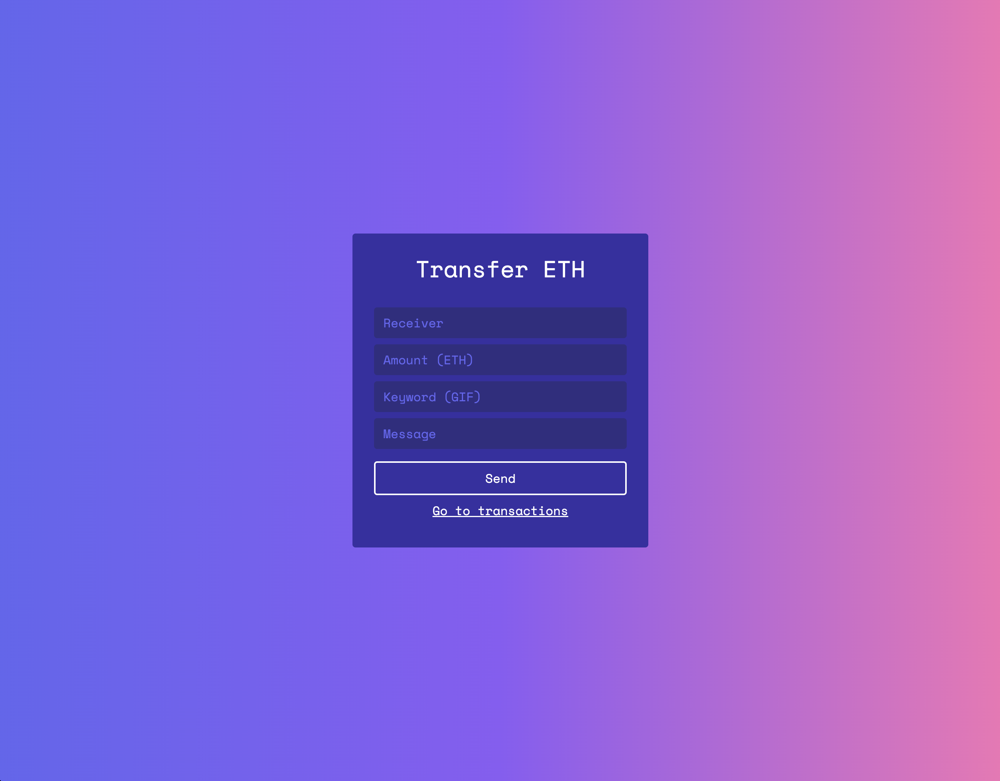
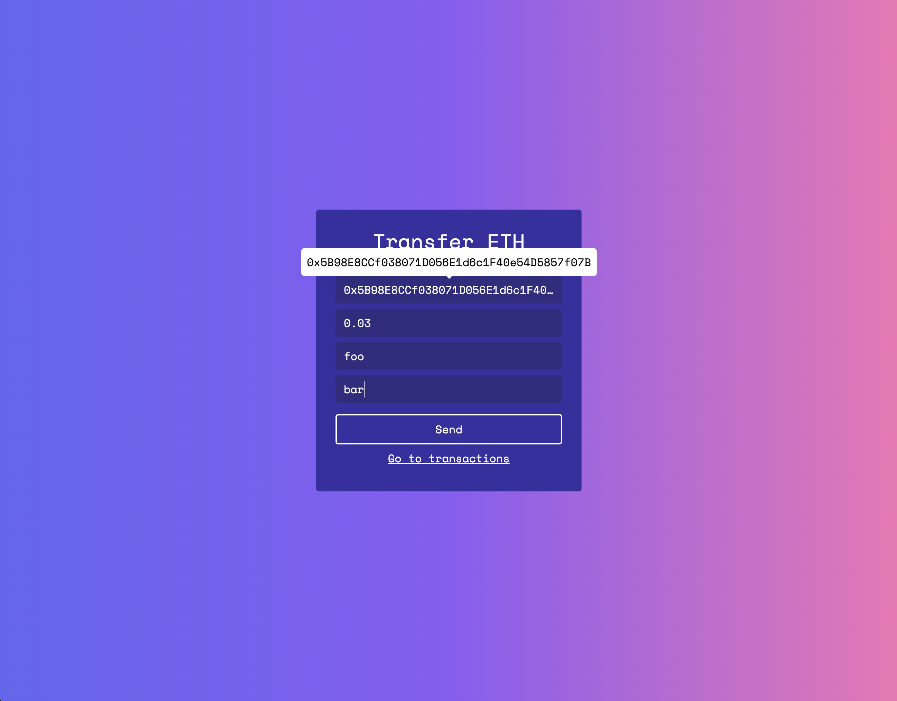
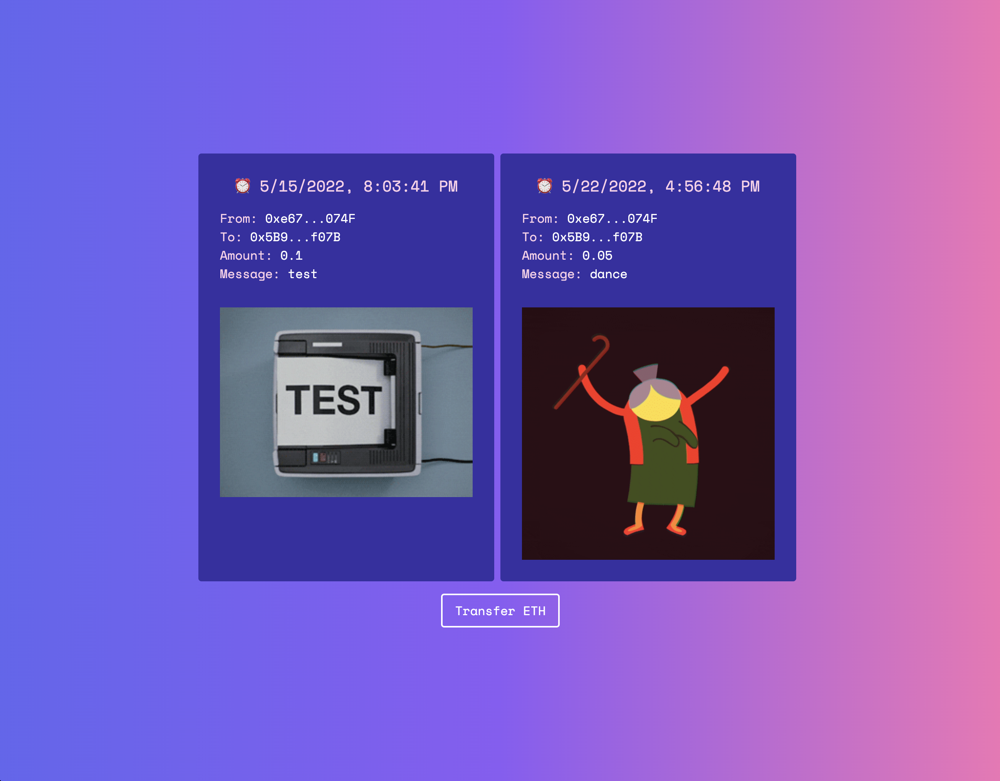

# my-first-dapp

This is my first web3 application that allows you to transfer ETH across the Rapsten Test Network. Inspired & guided by https://youtu.be/Wn_Kb3MR_cU.

<table>
  <tr>
    <td>
      
    </td>
    <td>
      
    </td>
    <td>
      
    </td>
  </tr>
</table>
